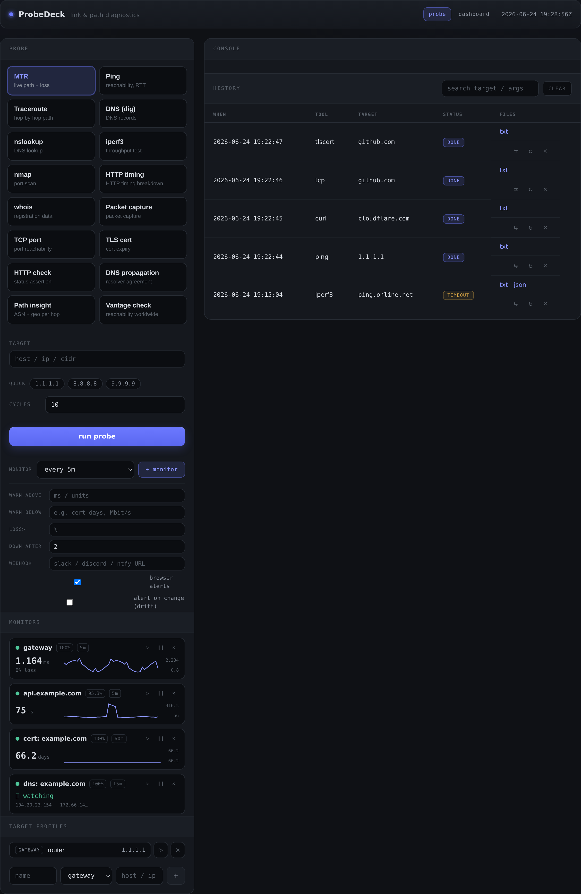
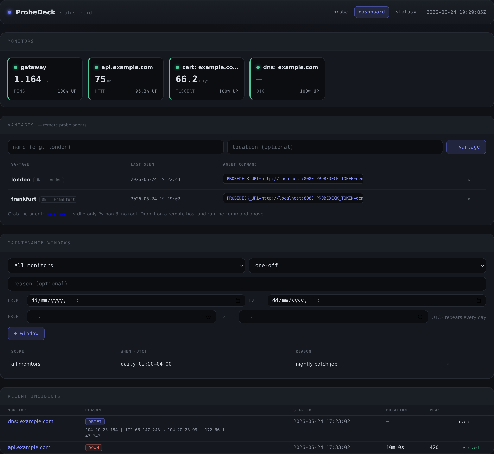
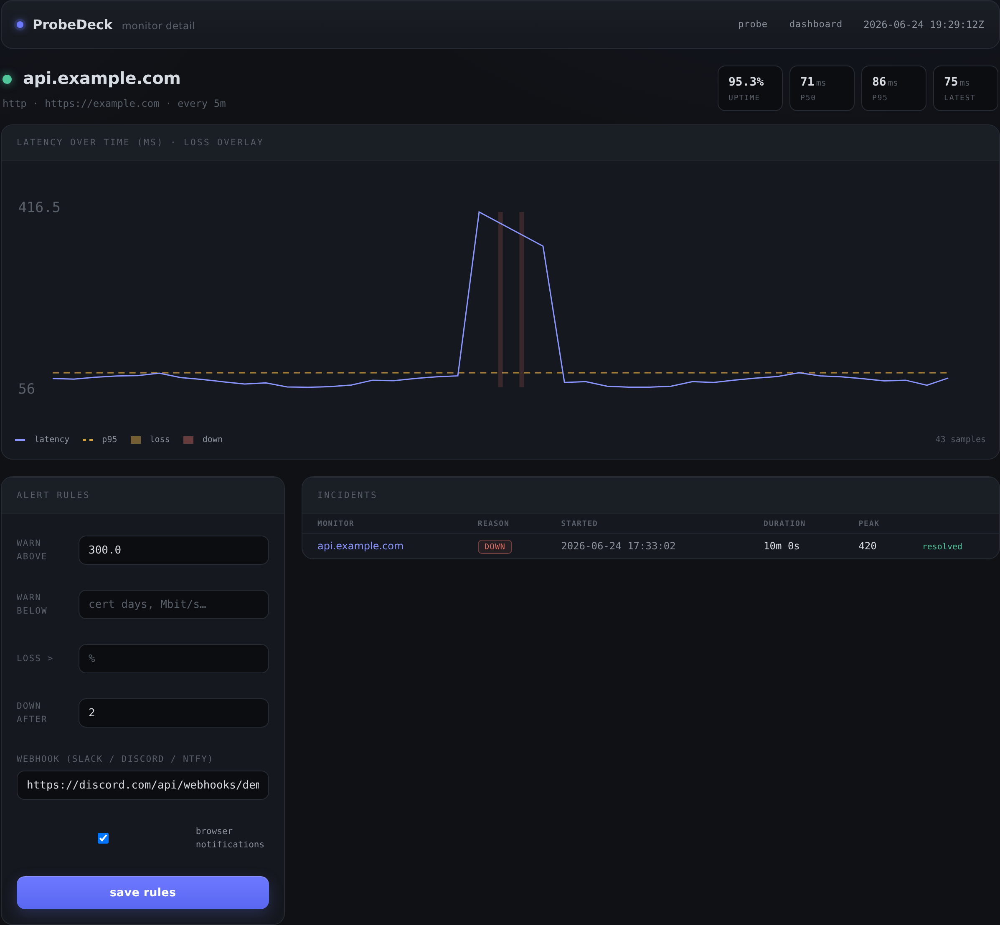
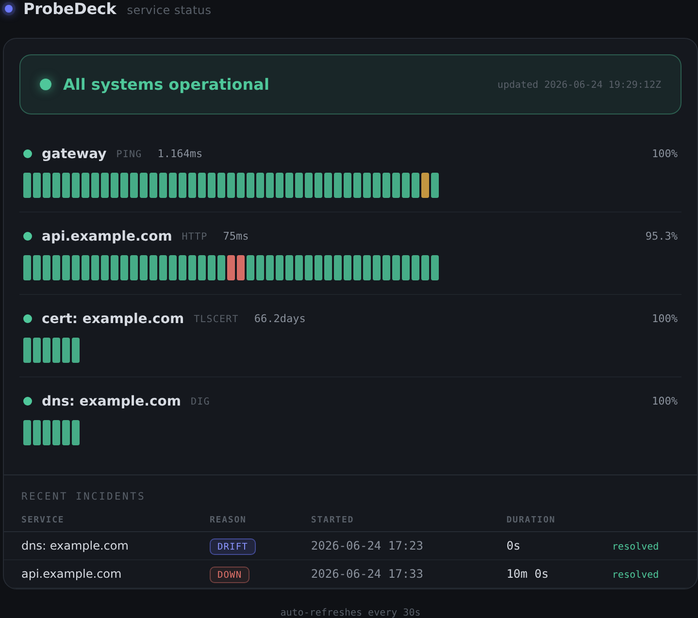

<div align="center">

# ProbeDeck

**A single-container network diagnostics, monitoring & alerting platform.**

Run any network probe from a web UI, schedule it as a monitor, get alerted when
something breaks, and watch it all on a dashboard, a shareable status page, and
from multiple geographic vantage points.

FastAPI · htmx · SQLite · one Docker image · no build step · no external services

📖 **[Full guide & tutorial →](https://zero-entry.co.za/posts/probedeck-guide/)**

</div>

---

## Contents

- [What it does](#what-it-does)
- [Screenshots](#screenshots)
- [Requirements](#requirements)
- [Quick start](#quick-start)
- [Configuration](#configuration)
- [Enabling login](#enabling-login)
- [Usage guide](#usage-guide)
  - [Run a probe](#run-a-probe)
  - [Tool reference](#tool-reference)
  - [History: search, compare, re-run, cancel](#history-search-compare-re-run-cancel)
  - [Saved profiles](#saved-profiles)
  - [DNS propagation & Path insight](#dns-propagation--path-insight)
  - [Monitoring](#monitoring)
  - [Alerts, thresholds & incidents](#alerts-thresholds--incidents)
  - [Drift monitoring](#drift-monitoring)
  - [Dashboard & detail view](#dashboard--detail-view)
  - [Public status page](#public-status-page)
  - [Maintenance windows](#maintenance-windows)
  - [Multi-vantage probing](#multi-vantage-probing)
  - [Install as an app (PWA)](#install-as-an-app-pwa)
- [Data & backups](#data--backups)
- [Updating](#updating)
- [Running the tests](#running-the-tests)
- [Security model](#security-model)
- [Project layout](#project-layout)
- [Extending](#extending)
- [Troubleshooting](#troubleshooting)
- [License](#license)

---

## What it does

**Probes** — run a tool, stream output live, keep searchable history.
- CLI tools (baked into the image): `mtr`, `ping`, `traceroute`, `dig`,
  `nslookup`, `iperf3`, `nmap`, `curl` (timing breakdown), `whois`,
  `tcpdump` (downloadable pcap).
- Native in-process probes (no subprocess): TCP connect, TLS cert expiry,
  HTTP status assertion.
- Fan-out tools: **DNS propagation** (a dozen public resolvers + authoritative
  NS) and **Path insight** (traceroute annotated with ASN / owner / country).

**Monitoring & alerting**
- Turn `ping`/`mtr`/`iperf3`/`curl`/`tcp`/`tlscert`/`http`/`dig` into recurring
  monitors with latency/loss sparklines and uptime %.
- Per-monitor alert rules + webhook (Discord/Slack/ntfy) + browser
  notifications; automatic incident open/close tracking.
- **Drift detection** — alert when a DNS record or TLS cert *changes*.

**Operations**
- Dashboard of status tiles → per-monitor detail with p50/p95 chart.
- Public, read-only **status page** (labels + uptime only — never targets).
- **Maintenance windows** to silence alerts during planned work.
- **Multi-vantage probing** with lightweight remote agents.
- Installable **PWA**.

---

## Screenshots

**Probe console + live monitors** — pick a tool, run it, and watch recurring
monitors trend in the sidebar.



**Dashboard** — status tiles with uptime %, remote vantage agents, maintenance
windows, and the incident log.



**Monitor detail** — a p50/p95 latency time-series with loss and outage overlay,
editable alert rules, and the monitor's incidents.



**Public status page** — a read-only board (labels + uptime only) you can share.



---

## Requirements

- A Linux host (a Raspberry Pi is plenty) with **Docker** and the **Docker
  Compose plugin**.
- Root/sudo only if your user isn't in the `docker` group.
- That's it — every diagnostic tool is installed inside the image; nothing is
  needed on the host.

Check you have what you need:

```bash
docker --version
docker compose version
```

---

## Quick start

```bash
# 1. Get the code
git clone https://github.com/<you>/probedeck.git
cd probedeck

# 2. Build and start (first build pulls the base image + tools, ~1–2 min)
docker compose up -d --build

# 3. Confirm it's running
docker compose ps
docker compose logs -f          # Ctrl-C to stop following
```

Then open **`http://<host-ip>:8080`** in a browser (use `http://localhost:8080`
if you're on the host itself).

> **Why host networking?** By default the container uses `network_mode: host`
> so probes run from the host's *real* network position — its routing table and
> VLAN interfaces, with no Docker bridge NAT distorting your traceroute/mtr
> hops. The app listens on `0.0.0.0:8080` on the host. See
> [Configuration](#configuration) to change this.

To stop / start / remove:

```bash
docker compose stop          # stop, keep data
docker compose start         # start again
docker compose down          # stop and remove the container (data persists in ./data)
```

---

## Configuration

All configuration is in **`compose.yml`** and a couple of environment variables.

| Setting | Default | Notes |
|---|---|---|
| Port | `8080` | The app listens on `0.0.0.0:8080`. With host networking, change the port in the `uvicorn` `CMD` (Dockerfile) or run behind a proxy. |
| `PROBEDECK_DATA` | `/data` | Where the SQLite db + run outputs live inside the container (mounted from `./data`). |
| `PROBEDECK_AUTH_USER` | unset | Username for optional login. |
| `PROBEDECK_AUTH_PASS` | unset | Password for optional login. Set **both** to require sign-in. |
| Volume | `./data:/data` | Persists everything. Back this up. |
| Caps | `NET_RAW`, `NET_ADMIN` | Raw sockets (mtr/ping/nmap) and packet capture (tcpdump). |

### Run without host networking (bridge mode)

If you'd rather isolate the container, edit `compose.yml`: remove
`network_mode: host` and add a published port:

```yaml
    # network_mode: host        # <- comment out / remove
    ports:
      - "8080:8080"             # <- add
```

Trade-off: probes then traverse Docker's NAT, so traceroute/mtr will show an
extra hop and latency from inside the bridge.

---

## Enabling login

The app is **open by default** (intended for a trusted LAN). Anyone who can
reach the UI can run `nmap`/`tcpdump` from your host, so if it's reachable
beyond a subnet you trust, turn on login.

Uncomment and set both variables in `compose.yml`:

```yaml
    environment:
      - PROBEDECK_DATA=/data
      - PROBEDECK_AUTH_USER=admin
      - PROBEDECK_AUTH_PASS=use-a-long-passphrase
```

Then `docker compose up -d` to recreate the container.

- Unauthenticated requests are redirected to `/login`.
- A successful login sets a **signed, HTTP-only session cookie** (7-day life).
- The signing key is derived from the password — changing the password
  invalidates all existing sessions, and no extra secret to manage.
- The login form itself is sent in cleartext. **Terminate TLS at a reverse
  proxy** if the app is reachable over any untrusted hop.

Two surfaces stay open on purpose even with login enabled:
- The **public status page** (`/status`, `/statusbars`) and PWA assets.
- The **agent API** (`/agent/jobs`, `/agent/results`, `/agent.py`), which is
  authenticated by a per-vantage **token** instead of the cookie.

---

## Usage guide

### Run a probe

1. Pick a tool from the grid on the left.
2. Enter a **target** (hostname, IP, or CIDR). Quick-pick chips and your last 5
   typed targets are offered.
3. Set any tool options (e.g. ping count, mtr cycles, iperf duration).
4. Click **run probe**. Output streams live into the console (over a WebSocket).

When it finishes you get headline **summary stats**, a **copy** button, and
**txt / json / pcap** downloads where the tool supports them.

### Tool reference

| Tool | What it does | Notable options |
|---|---|---|
| **MTR** | Live path + loss (JSON report) | cycles |
| **Ping** | Reachability, RTT, loss | count |
| **Traceroute** | Hop-by-hop path | — |
| **DNS (dig)** | DNS records | type, resolver |
| **nslookup** | DNS lookup | resolver |
| **iperf3** | Throughput test | server, duration, port, reverse |
| **nmap** | Port scan (top-100, polite) | extra args |
| **HTTP timing (curl)** | DNS/connect/TLS/TTFB/total breakdown | — |
| **whois** | Registration data | — |
| **Packet capture (tcpdump)** | Capped capture → pcap | packets, interface |
| **TCP port** | Connect + handshake time | port |
| **TLS cert** | Certificate days-to-expiry | port, servername |
| **HTTP check** | Status assertion | method, expected code |
| **DNS propagation** | Resolver-agreement fan-out | record type |
| **Path insight** | Traceroute + ASN/geo per hop | — |
| **Vantage check** | Run from multiple locations | probe type + its options |

### History: search, compare, re-run, cancel

Every run is indexed in **history** (right column):
- **Search** by target or args.
- **⇆ compare** — pick two finished runs to view side by side.
- **↻ re-run** — fire a past run again with its original options.
- **✕ delete** a run, or **clear** the whole history (removes output files too).
- **stop** a running probe from the console.

### Saved profiles

Save targets you hit often (gateway, iperf server, resolvers) under **target
profiles** so you stop retyping them. Each profile knows a sensible default
tool for its kind; click to load it, or the ▶ to load-and-run.

### DNS propagation & Path insight

- **DNS propagation** queries ~12 public resolvers **and** the domain's
  authoritative nameservers at once, groups the answers, and flags any resolver
  that disagrees — useful right after changing a record.
- **Path insight** runs a numeric traceroute and annotates each hop with its
  **ASN / network owner / country** (via Team Cymru), highlighting the hop where
  the network operator changes (handoffs are where paths tend to break). Can
  take 30–60s.

### Monitoring

Select a monitorable tool, configure it, then use the **+ monitor** control
(appears for `ping`, `mtr`, `iperf3`, `curl`, `tcp`, `tlscert`, `http`, `dig`):

1. Choose an interval (1m / 5m / 15m / 30m / 1h).
2. Optionally set alert rules and a webhook (below).
3. Click **+ monitor**.

A background scheduler samples each monitor on its interval and stores a
time-series. The monitors list shows the latest reading and a sparkline; the
dashboard and detail views show more.

### Alerts, thresholds & incidents

Each monitor can carry rules:

| Rule | Fires when | Good for |
|---|---|---|
| **warn above** | value goes **above** the number | latency, HTTP time |
| **warn below** | value drops **below** the number | TLS cert **days remaining**, iperf throughput |
| **loss >** | packet loss exceeds % | ping/mtr |
| **down after N** | N consecutive failing/breaching checks | debouncing flaps |

When breaches reach the **down after** threshold an **incident opens**; it
**closes** automatically on the next healthy sample. On each open/close edge
ProbeDeck fires:

- **A webhook**, if you set a URL. The JSON body carries both `content`
  (Discord) and `text` (Slack / ntfy), so one URL works across them:

  ```
  🔴 ProbeDeck: api-gateway is DOWN — above threshold (412ms)
  🟢 ProbeDeck: api-gateway recovered (38ms)
  ```

- **A browser notification** (the page asks permission the first time you create
  a monitor; these arrive while a ProbeDeck tab is open).

Incidents are listed on the dashboard and each monitor's detail page, with
duration and the peak value seen.

> **Example — alert before a cert expires:** monitor a host with the `tlscert`
> tool and set **warn below = 14** (days). You'll get an incident + webhook two
> weeks out.

### Drift monitoring

For `dig` and `tlscert` monitors, enable **alert on change (drift)**. ProbeDeck
fingerprints the result (the **DNS answer set**, or the **TLS cert serial**) and
fires a one-shot drift event — with the old → new values — when it changes. The
first observation just sets the baseline (no false alert).

### Dashboard & detail view

`/dashboard` shows every monitor as a colour-coded tile (green / amber / red /
blue-for-maintenance) with uptime %. Click a tile for the **detail view**: a
latency time-series chart with **p50/p95** lines and a loss/down overlay,
editable alert rules, the monitor's incident log, and (for drift monitors) its
current fingerprint.

### Public status page

`/status` is a **read-only, no-login** board you can share:
- An overall banner (operational / degraded / outage).
- Per-service uptime history bars + uptime %.
- Recent incidents.

It exposes **labels and uptime only** — never the underlying targets, ports or
options. There's a `status ↗` link from the dashboard.

### Maintenance windows

Planned work shouldn't page you. On the dashboard, add a window:
- **One-off** (`from` / `to` datetime) or **daily** (HH:MM–HH:MM, repeats), in
  **UTC**.
- Scoped to **one monitor** or **all monitors**.

While a window is active, alerts are silenced (no incidents open, no webhooks /
notifications), the breach streak is frozen so there's no storm when it ends,
and an open incident is still allowed to resolve quietly. Affected monitors show
a blue **maintenance** state.

### Multi-vantage probing

Run the same check from several places at once — this server ("central") **plus**
remote agents — to tell *"down for everyone"* from *"down from here."*

**1. Register a vantage.** On the dashboard, under **vantages**, add a name and
location. It generates a token and shows a ready-to-run command.

**2. Run the agent on a remote host** (anything with Python 3 — another VPS, a
box in a different region, a friend's Pi):

```bash
# download the agent from your ProbeDeck server
curl -O http://<your-server>:8080/agent.py

# run it with the values shown on the dashboard
PROBEDECK_URL=http://<your-server>:8080 \
PROBEDECK_TOKEN=<token-from-dashboard> \
python3 agent.py
```

The agent is a **single stdlib-only file** (no pip install, no root for
TCP/HTTP/TLS/DNS; `ping` uses the system binary where present). It polls for
jobs, runs them locally, and reports back. Optional `PROBEDECK_INTERVAL`
(seconds, default 3). Run it under systemd / `tmux` / `nohup` to keep it alive.

**3. Run a Vantage check.** Pick **Vantage check** in the tool grid, choose a
probe type (TCP / Ping / HTTP / TLS cert / DNS) and target. Results fill in
per-location as agents report; the card shows reachability and latency for each
vantage, with the central server marked ★. The dashboard shows each vantage's
**last-seen** time.

### Install as an app (PWA)

ProbeDeck ships a web app manifest, icons, and a service worker, so you can
**Add to Home Screen** (mobile) or install it (desktop Chrome/Edge). The layout
is responsive for phones.

> Browsers only register service workers over **HTTPS or `localhost`**. Over a
> plain-HTTP LAN IP the manifest/icons and iOS "Add to Home Screen" still work,
> but offline caching won't activate — front the app with HTTPS (e.g. a reverse
> proxy or Tailscale) for the full PWA experience.

---

## Data & backups

Everything persists in **`./data`** next to `compose.yml`:

```
data/
  probedeck.db          SQLite: history index, monitors, samples,
                        incidents, maintenance, vantages, checks
  results/<job_id>/     per-run output.txt, output.json, capture.pcap
```

To back up, stop the app (or just snapshot live — SQLite is robust) and copy the
`data/` directory:

```bash
docker compose stop
tar czf probedeck-backup-$(date +%F).tar.gz data/
docker compose start
```

Restore by putting `data/` back before `docker compose up`.

---

## Updating

```bash
git pull
docker compose up -d --build
```

The SQLite schema **auto-migrates** on startup (new columns/tables are added in
place), so your history, monitors, and incidents survive upgrades.

---

## Running the tests

A stdlib `unittest` suite (no extra dependencies) covers the output parsers,
metric extraction, fingerprinting, alert evaluation, target validation, path
parsing, and the DB-backed incident / maintenance / vantage logic.

In the running container:

```bash
docker exec -e PROBEDECK_DATA=/tmp/pdtest probedeck \
    python -m unittest discover -s tests -v
```

Or locally with Python 3.12:

```bash
pip install -r app/requirements.txt
cd app && PROBEDECK_DATA=/tmp/pdtest python -m unittest discover -s tests
```

CI (`.github/workflows/ci.yml`) runs the suite and a Docker build on every push.

---

## Security model

The core invariant: **a target never reaches a command as anything but a
validated, single argv element, and probes never touch a shell.**

- **Allowlist:** every target is validated (hostname / IP / CIDR) before
  reaching any builder; spaces, shell metacharacters, and command substitution
  are rejected. This holds for one-off runs, monitors, fan-out tools, and
  multi-vantage checks (validated centrally before a job is handed to an agent).
- **No shell:** CLI tools are executed in argv form without a shell. Native
  probes (TCP/TLS/HTTP/DNS) use `socket`/`ssl`/`urllib` directly — no subprocess
  at all.
- **Agents run a fixed probe set** and never execute server-supplied commands —
  there is no server→agent remote-code-execution path.
- **Operator raw args** (nmap `extra`) are shlex-split and screened for
  redirects/chaining.
- **Webhook URLs** must be http(s); a dead webhook can't break sampling.
- **Timeouts** kill hung/runaway processes; tcpdump is packet-capped so a
  forgotten capture can't fill the disk.

Still: this is a tool that can run `nmap` and `tcpdump` from your host. Treat the
UI as a sensitive endpoint — restrict it to a trusted subnet, enable login,
and/or put it behind an authenticating TLS proxy.

---

## Project layout

```
probedeck/
  Dockerfile, compose.yml
  app/
    main.py         FastAPI routes, lifespan scheduler, view helpers
    runner.py       async subprocess lifecycle (+ native execution path)
    tools.py        CLI builders, target allowlist, native-tool registry
    probes.py       native in-process probes (tcp/tls/http/ping/dns)
    summarize.py    raw output -> headline (label, value) stats
    monitor.py      recurring sampler, alert state machine, drift, maintenance
    dnsprop.py      DNS propagation fan-out
    pathinsight.py  traceroute + Team Cymru ASN/geo annotation
    vantage.py      multi-vantage check orchestration
    db.py           SQLite schema, migrations, queries
    auth.py         optional login
    templates/      htmx UI
    static/         css, htmx, PWA assets, agent.py
    tests/          unittest suite
  data/             volume: probedeck.db + results/<job_id>/
  .github/workflows/ci.yml
```

---

## Extending

**Add a CLI tool:** add an entry to `TOOLS` in `tools.py` with a builder that
returns an argv list, plus a `<div class="opts" data-for="yourtool">` block in
`index.html` for its options. The runner, history, and downloads pick it up
automatically. Add a parser in `summarize.py` for headline stats.

**Add a native probe:** write `async def probe(target, opts) -> str` in
`probes.py`, register it in `TOOLS` with `"native": True` and a `describe`, and
add a `summarize` parser so the same pipeline applies.

**Make a tool monitorable:** add it to `MONITORABLE` in `monitor.py` and give
`metric_for` a branch returning `(ok, value, unit, loss)`.

---

## Troubleshooting

**`docker compose` says permission denied.** Add your user to the `docker`
group (`sudo usermod -aG docker $USER`, then log out/in) or prefix commands with
`sudo`.

**UI loads but probes fail with raw-socket / permission errors.** The container
needs `NET_RAW` (mtr/ping/nmap) and `NET_ADMIN` (tcpdump). These are in
`compose.yml`; some hardened hosts also need `apparmor`/`seccomp` adjustments.

**Traceroute/mtr show an extra first hop with odd latency.** You're running in
bridge mode — that hop is Docker's NAT. Use `network_mode: host` to measure from
the host's real position.

**Browser notifications don't appear.** They require a granted permission and an
open ProbeDeck tab. For alerts with the tab closed, use the **webhook** instead.

**A vantage stays "pending / no response."** The agent isn't reaching the
server. Check `PROBEDECK_URL` is reachable from the remote host, the
`PROBEDECK_TOKEN` matches, and the agent process is still running. Unfinished
results are marked "no response" after ~45s.

**Service worker / install option missing.** Service workers need HTTPS or
`localhost`; over a plain LAN IP, install/offline is limited by the browser, not
the app.

**Port 8080 already in use.** Change the port in the Dockerfile `CMD`
(host networking) or in the `ports:` mapping (bridge mode).

---

## License

[MIT](LICENSE) © ProbeDeck contributors.
